# SE FinalReport

## db 設計圖
`USERS` 裡面的 role 會有四個種類
'customer'，'store'，'delivery_personnel'，'platform'，對應到角色。
`MENU_ITEMS` 是可以點的食物，(商家創建)
`ORDER_ITEMS` 是客戶點的食物，(客戶創建)
`ORDERS` 是訂單(客戶創建)，資訊最多
`FEEBACK` 我這裡改成只針對 `ODERS` 
`TRANSACTIONS` 也是只針對 `ODERS`
sql 可以多利用 join 找自己要的東西

```mermaid
erDiagram
    USERS {
        INT user_id PK
        VARCHAR name
        VARCHAR email
        VARCHAR password
        ENUM role
    }
    CUSTOMERS {
        INT customer_id PK
        INT user_id FK
        VARCHAR address
        VARCHAR phone_number
    }
    STORES {
        INT store_id PK
        INT user_id FK
        VARCHAR store_name
        VARCHAR address
        VARCHAR phone_number
    }
    DELIVERY_PERSONNEL {
        INT delivery_id PK
        INT user_id FK
        BOOLEAN availability_status
    }
    MENU_ITEMS {
        INT item_id PK
        INT store_id FK
        VARCHAR item_name
        DECIMAL price
        TEXT description
        ENUM status
        VARCHAR img
    }
    ORDERS {
        INT order_id PK
        INT customer_id FK
        INT store_id FK
        INT delivery_id FK
        DECIMAL total_price
        ENUM status
        DATETIME created_at
        DATETIME updated_at
    }
    ORDER_ITEMS {
        INT order_item_id PK
        INT order_id FK
        INT item_id FK
        INT quantity
        DECIMAL price
    }
    FEEBACK {
        INT review_id PK
        INT order_id FK
        INT target_id
        ENUM target_role
        INT rating
        TEXT comment
        DATETIME created_at
    }
    TRANSACTIONS {
        INT transaction_id PK
        INT order_id FK
        DECIMAL store_amount
        DECIMAL delivery_amount
        DECIMAL customer_amount
        DATETIME created_at
    }

    USERS ||--o{ CUSTOMERS : ""
    USERS ||--o{ STORES : ""
    USERS ||--o{ DELIVERY_PERSONNEL : ""
    STORES ||--o{ MENU_ITEMS : ""
    CUSTOMERS ||--o{ ORDERS : ""
    STORES ||--o{ ORDERS : ""
    DELIVERY_PERSONNEL ||--o{ ORDERS : ""
    ORDERS ||--o{ ORDER_ITEMS : ""
    MENU_ITEMS ||--o{ ORDER_ITEMS : ""
    ORDERS ||--o{ FEEBACK : ""
    ORDERS ||--o{ TRANSACTIONS : ""

```

## git
git 的儲存庫可以簡單分為兩種，一個是 local 的(就是存在自己電腦的)，一個是 remote 的(github 看到的那個)。

### 拿 github 的 code
可以工作的目錄下面用 clone 把東西載下來。

- **clone 指令：**`git clone https://github.com/dreamaker0224/FinalReport.git`

### 更新 github
更新 local 端的用 commit，更新 remote 端的用 push。要更新 github 上面的東西的話就是先 commit，確認沒問題後再 push。

- **add 指令：**`git add .`

- **commit 指令：**`git commit -m "輸入版本訊息"`

- **push 指令：**`git push https://github.com/dreamaker0224/FinalReport.git`

### 更新 github 不影響其他人的更新
這個就先用 pull 下來，跟其他人的合併，然後再用上面更新 github 的方法更新。

- **pull 指令：**`git pull https://github.com/dreamaker0224/FinalReport.git`

:::info
要學其他的話可以看下面的文章跟影片

講一些指令
[新手也能懂的 git 教學(Medium)](https://medium.com/@flyotlin/%E6%96%B0%E6%89%8B%E4%B9%9F%E8%83%BD%E6%87%82%E7%9A%84git%E6%95%99%E5%AD%B8-c5dc0639dd9)

git 概念介紹
[看完就懂 git (youtube)](https://youtu.be/N6YQlPuAamw?si=-NHyoqi4ZeWfGnf1)

github 介紹及簡單指令
[人人都能用 github (youtube)](https://youtu.be/N6YQlPuAamw?si=-NHyoqi4ZeWfGnf1)
:::
